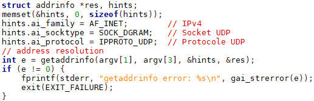
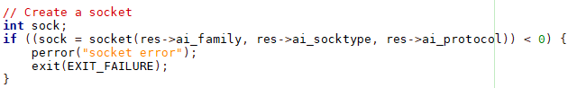

# ENSEA_2A_TFTP_HILMI_HAAS

## Objectives: Create a TFTP client, using RFCs and wireshark captures.

### Q1)
We tested the three arguments: The program sends two arguments on the command line which are the server address
and the name of the file to download or upload, as you can see in the screenshots below:

### Q2)
Then, we called getaddrinfo to get the server address and we noticed that it works well
because we saw the display of "success" without error as shown below:

### Q3)
Then, we created a UDP socket knowing that the TFTP protocol uses UDP, because it is light and fast, and then we tested it
and we noticed that it works well by still receiving "success Q3", as you can see in the screenshots below:

### Q4)
For gettftp :
#### a) We constructed a correctly formed read request (RRQ), and then sent it to the
server.
#### b) We received a file consisting of a single data packet (DAT) and its acknowledgement (ACK) and then looked

